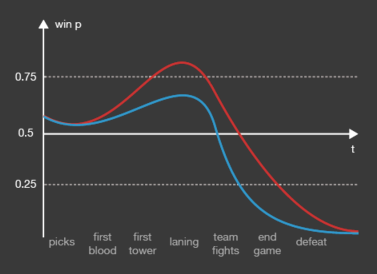

Dota Science Challenge Hackathon
================================

Хакатон по предсказанию результата матчей [Dota 2](https://en.wikipedia.org/wiki/Dota_2) в турнире [Shanghai Major 2016](http://wiki.teamliquid.net/dota2/Shanghai_Major/2016). 

В рамках хакатона будем рассматривать две задачи:

#### Задача 1: Предсказание команды-победителя в матче до его начала

Необходимо до начала матча предсказать команду, которая вероятно победит и указать прогнозируемую вероятность победы. Предсказание можно корректировать — в таблице результатов будет учитываться только последнее значение предсказания, которое было отправлено <u>до начала матча</u>. Обратите внимание, что до начала матча не известно, за какую сторону (Radiant или Dire) будет играть какая команда, какими героями будут играть команды — все это станет известно по ходу матча.

После завершения матча, когда будет определен победитель, качество предсказания будет оцениваться при помощи следующей функции:
```
Score = log2(P_winner) + 1
```
здесь `P_winner` — последнее предсказанное значение вероятности победы в матче для команды, которая в итоге победила. Т.е. если Вы предсказали победу команды X с вероятностью 0.8, а выиграл ее соперник Y, то ваш скор за матч будет вычисляться так: `Score = log2(1 - 0.6) + 1`, где `(1 - 0.6)` — предсказанная Вами вероятность победы команды Y.

Предсказание 50/50, не имеющее никакой ценности, оценивается Score в 0. Максимально возможное значение Score — 1.0 можно получить если с вероятностью 1 угадать победившую команду. Однако, если излишне уверенно (с вероятностью близкой к 1) предсказать победу команды, которая проиграет, то значение Score устремится в -∞; к счастью, мы ограничиваем урон, наносимый слишком уверенным предсказанием числом равным -100, но оцениваться будет сумма очков по нескольким матчам, поэтому, грамотно оценивайте свои риски.

#### Задача 2: Предсказание вероятности победы в режиме реального времени

Гораздо более интересная задача, которая требует помимо навыков анализа данных, умение строить предсказательные модели и запускать их в автоматическом режиме.

В отличие от предыдущей задачи, предсказание можно корректировать не только до начала матча, но еще на всем его протяжении, вплоть до его завершения.



На протяжении матча будет происходить множество событий, каждое из которых несет в себе часть информации о том, кто победит. Так в самом начале матча будет определено, какая команда играет за какую сторону, еще через несколько минут после начала будет определена комбинация героев, затем команда, совершивкая first blood, и т.д.

Качество предсказаний будет оцениваться как интеграл введенного выше Score по времени, от начала матча до его завершения:


Чем быстрее Ваша предсказательная модель начнет давать уверенное предсказание команды-победителя, тем больший Realtime-Score она получит. В случае, если модель на протяжении всего матча будет предсказывать 50/50, а когда станет очевидным победа одной из сторон — вероятность 1, Realtime-Score будет очень малым за счет того что период времени, в который `Score(t) = 1` будет очень коротким.

### Как участвовать?

- Заполните [форму регистрации](http://goo.gl/forms/uItP82XCOQ), мы вышлем вам API-ключ, по которому можно будет отправлять предсказания.
- Если вы уже получили ключ — читайте описание API далее.
- [Таблица матчей](http://alchemist.dotascience.com/matches/)
- [Схема турнира Shanghai Major 2016](http://wiki.teamliquid.net/dota2/Shanghai_Major/2016#Main_Event)
- Начинать отправлять предсказания можно уже сейчас
- Можно (и нужно) пользоваться всеми известными техниками наук о данных, выкачивать все что можно выкачивать, использовать сторонние библиотеки

### Описание API

Взаимодействие с системой сбора предсказаний происходит через HTTP API, почти все функции API требуют ключ. Ключ выдается индивидуально каждому участнику (или команде). Ключ необходимо указать в запросе в виде HTTP-заголовка `Key: <your-personal-key>`, либо в качестве параметра URL: `http://...?key=<your-personal-key>`.

#### Список матчей

Запрос: `GET http://alchemist.dotascience.com/api/matches`

Пример ответа:
```python
{
  "matches": [
    {
      "id": 13,
      "status": 2,  # Состояние матча
                    # 0 - Аннонсирован
                    # 1 - Идет в данный момент
                    # 2 - Завершен (известен победитель)
      
      "cell": 4,           # Положение матча в турнирной таблице
      "order_in_cell": 1,  # Номер игры, в случае если команды 
                           # играют несколько матчей (best-of-3)
      
      "participants": [   # Команды-участники
        {
          "team_id": 4, 
          "team_name": "EHOME"
        }, 
        {
          "team_id": 2244697, 
          "team_name": "Team Archon"
        }
      ],
      
      "steam_match_id": 2191757537,   # match_id в Steam API 
                                      # (известен после начала матча)
    }, 
    ...
  ]
}
```

#### Отправка предсказания

Запрос: `POST http://alchemist.dotascience.com/api/match/<id>/prediction`

Пример содержимого запроса:
```python
{
  "team_id": 2244697,  # id команды
  "probability": 0.6   # вероятность победы указанной команды в матче
}
```

Поле `probability` принимает вещественное значение от 0 до 1 и означает вероятность победы указанной в поле `team_id` команды. Вероятность победы соперника указанной команды считается равным `1 - probability`.

Пример ответа:
```python
{
  "ok": true,
  "time": 1457003701.0  # unixtime полученного предсказания
}
```

#### Список отправленных предсказаний

Запрос: `GET http://alchemist.dotascience.com/api/match/<id>/prediction`

Пример ответа:
```python
{
  "account_name": "peter",
  "match_id": 13, 
  "predictions": [
    {
      "team_id": 2244697, 
      "probability": 0.6, 
      "time": 1457003701.0
    },
    ...
  ]
}
```

#### Состояние матча в текущий момент времени

Запрос: `GET http://alchemist.dotascience.com/api/match/<id>/status`

По запросу возвращается текущее состояние матча, и, если матч в процессе — различные характеристики игры (золото по игрокам, положение игроков на карте, текущий счет и т.д.). Информация про каждый матч обновляется примерно 1 раз в 10 секунд.

Пример ответа: 
```python
{
  "match_id": 42, 
  "steam_match_id": 2198989614   # match_id в Steam API 
  "status": 1,                   # 0 — Announced, 1 — Running, 2 — Finished
  
  "start_time": 1457173491.0,    # время начала и конца матча (если известно), unixtime
  "finish_time": null, 

  "team_radiant": 1148284,       # команда, которая играет за сторону Radiant (если известно)
  "team_dire": 39,               # ... за сторону Dire
  
  "winner": null,                # победитель матча (если известно) — "radiant" или "dire"

  "live_info": {                 # запись из Steam API о состоянии матча в текущий момент времени
    "match_id": 2198989614,
    "stream_delay_s": 300.0,     # задержка в секундах трансляции матча (ровно как и информации о нем)
    "spectators": 20866,         # число наблюдателей
    "scoreboard": {
      "duration": 0.0,           # длительность игры на текущий момент
                                 # (в данном примере 0, поскольку идет стадия пиков/банов)
      
      "radiant": {               # информация про команду radiant
        "picks": [
            {"hero_id": 58},     # пикнутые герои, см. расшифровку hero_id в каталоге dictionaries/
            {"hero_id": 20}, 
            {"hero_id": 106}
          ], 
        "bans": [
          {"hero_id": 55}, 
          {"hero_id": 65}, 
          {"hero_id": 13}, 
          {"hero_id": 74}
        ], 
        "barracks_state": 63,   # состояние барраков
        "tower_state": 2047,    # состояние башен
                                # задаются битовыми масками (см. https://wiki.teamfortress.com/wiki/WebAPI/GetMatchDetails#Tower_Status)
        
        "players": [            # детальная информация про игроков в команде
          {
            "account_id": 145550466,  # номер Steam-аккаунта
            "position_x": 0.0,        # положение игрока на карте
            "position_y": 0.0, 
            "gold": 625,              # золото игрока
            ...
          },
          ...
        ]
          
  }
}
```

Формат поля `live_info` частично описан [здесь](https://wiki.teamfortress.com/wiki/WebAPI/GetLiveLeagueGames). Идентификаторы героев, предметов (`hero_id`, `item_id`, и т.д.) можно расшифровать при помощи таблиц из каталога [`dictionaries/`](./dictionaries).

Есть возможность взять не только последнее известное состояние матча, а изменения `live_info` с течением времени. Для этого укажите URL-параметр `history=N`, где N — максимальное число изменений, которые необходимо вернуть. В результате запроса с указанным параметром `history` придет ответ с полем `live_history` — массив изменений поля `live_info` начиная с самого позднего, заканчивая более ранними. 

#### Качество предсказаний команд (лидерборд)

Запрос: `GET http://alchemist.dotascience.com/api/leaderboard`

Пример ответа:
```python
{
  "update_time": 1457003923.0,   # время последнего обновления таблицы результатов
  "leaderboard": [
    {
      "account_id": 2, 
      "account_name": "avsirotkin",     # аккаунт участника

      "predicted_matches": 6,   # матчей, для которых отправлено предсказание
      "predictions": 15,        # всего отправлено предсказаний по всем матчам
      
      "score_max": 0.3713518765363535,  # максимальный скор среди всех матчей
      "score_sum": 0.15635789186437565, # суммарный ...
      "score_avg": 0.02605964864406261, # средний по всем предсказанным матчам ...


      "match_scores": [          # результат предсказания отдельно по каждому матчу 
        {
          "match_id": 7, 
          "num_predictions": 5,                     # число предсказаний по матчу
          "score": 0.3713518765363535,              # итоговый скор
          "last_prediction_time": 1456966298.0,     # время последнего учтенного предсказания
          "winner_probability": 0.646782198327222   # последняя (до начала матча) предсказанная вероятность 
                                                    # победы команды, которая в итоге победила
        },
        ...
      ]
    }
```

В данный момент лидерборд считается только для предсказания победы до начала матча (задача 1). Лидерборд для риал-тайм предсказаний будет доступен позже.

### Примеры работы с API

#### Python

Удобно использовать библиотеку [`requests`](http://docs.python-requests.org/en/master/).

```python
>>> import requests
>>> api_key = 'BC5141CAA...518F53'

# получение списка матчей
>>> resp = requests.get('http://alchemist.dotascience.com/api/matches', headers={'Key': api_key})
>>> resp.json()
{'matches': [...]}

# отправка предсказания
>>> resp = requests.post('http://alchemist.dotascience.com/api/match/13/prediction', 
...                     json={'team_id': 2244697, 'probability': 0.6}, headers={'Key': api_key})
>>> resp.json()
{'ok': True, 'time': 1457003701.0}
```

#### R

Удобно использовать пакет [`httr`](https://cran.r-project.org/web/packages/httr/index.html).

```R
require(httr)
current.leaderboard.json <- GET('http://alchemist.dotascience.com/api/leaderboard')
current.leaderboard <- content(current.leaderboard.json, "parsed") 
current.leaderboard$leaderboard
```

## Пример предсказательных моделей

- [Прогноз результата матча при помощи TrueSkill](examples/SimpleTrueSkillModel.ipynb)
